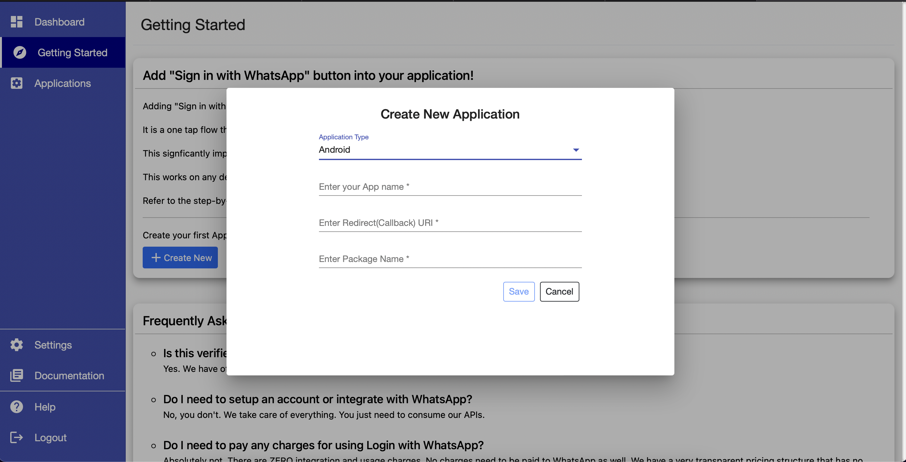
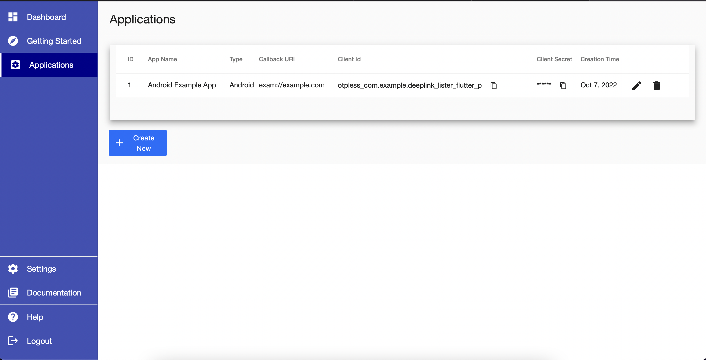
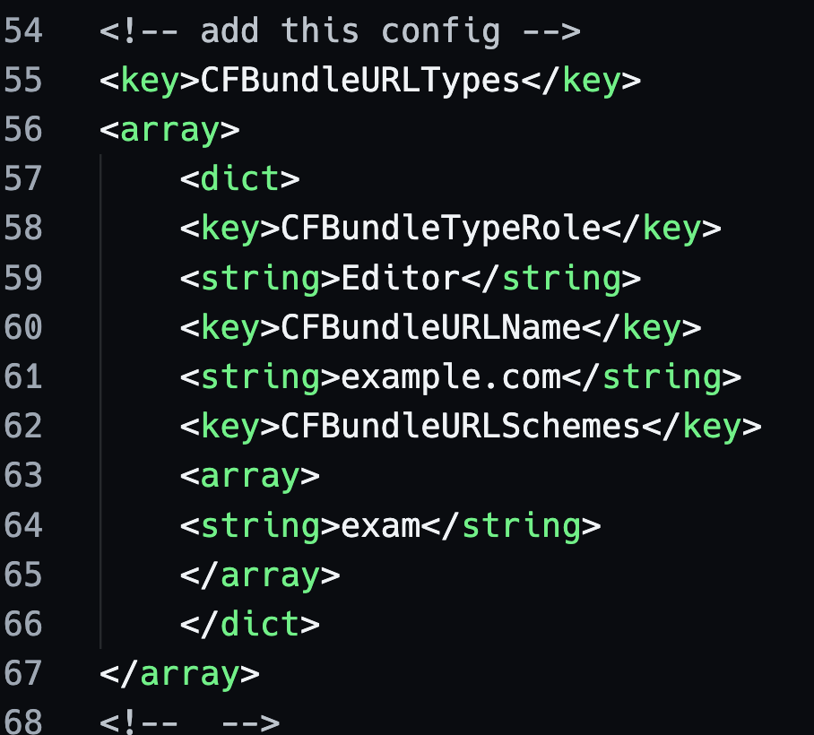

# OTPLess Flutter Plugin

Integrate OTPless "login with whatsapp" functionality

# Getting Started
## Native Part (Permissions)
### 1. Copy the application name, Package Name and Bundle Id and create an OTPLess account
- Visit [OTPless Website](www.otpless.com)



### 2. Go to the Applications tab in sidebar and copy the callback URI

- Callback URI should be the deeplink for your application



### 2. Added Required Permissions

#### For iOS

- add the following keys in Info.plist file for sucessfull deeplinking of callback uri
- call back URI has two parts one is scheme and another is domain
- for Example: For URI "exam://example.com", _"exam"_ will be scheme and _"example.com"_ will be the domain
- we need to add the domain and scheme to the Info.Plist file

```xml
<key>CFBundleURLTypes</key>
<array>
    <dict>
    <key>CFBundleTypeRole</key>
    <string>Editor</string>
    <key>CFBundleURLName</key>
    <string>your_app_domain</string>
    <key>CFBundleURLSchemes</key>
    <array>
    <string>your_app_scheme</string>
    </array>
    </dict>
</array>
```

- example (query permission)
  

- We also need the query permission to check whether the user has Whatsapp installed in his/her device

```xml
<key>LSApplicationQueriesSchemes</key>
<array>
    <string>whatsapp</string>
</array>
```

- example (query permission)
  

#### For Android

- The AndroidMainfest.xml must be modified to for deeplinking
- Paste this xml snippet in AndroidManifest.xml present inside `android/app/src/main/AndroidManifest.xml` inside the `<activity>` tag

```xml
<intent-filter android:autoVerify="true">
    <action android:name="android.intent.action.VIEW" />
    <category android:name="android.intent.category.DEFAULT" />
    <category android:name="android.intent.category.BROWSABLE" />
    <data android:scheme="your_app_scheme" android:host="your_app_domain"  />
</intent-filter>
```
- If you got more doubt please check the example app's AndroidManifest

## Flutter Part (Implementation)

### Import the plugin in your Flutter project
**NOTE : USE THE PLUGIN IN APPLICATION'S ENTRY POINT Eg. in the root route (starting page) "/"**

```dart
import 'package:otpless_flutter/otpless_flutter.dart';
```

### Create an instance of plugin and store in a local variable

```dart
final _otplessFlutterPlugin = Otpless();
```

### Function for initiating the login process
- To get your application's specific intentUrl please read the [doc mentioned here](https://docs.otpless.com/start-to-verify/rest-api)

```dart
 // ** Function to initiate the login process
  void initiateWhatsappLogin(String intentUrl) async{
    var result = await _otplessFlutterPlugin.loginUsingWhatsapp(intentUrl: intentUrl);
    switch (result['code']) {
      case "581":
        print(result['message']);
        //TODO: handle whatsapp not found
        break;
      default:
    }
  }
```

### Listen to token changes
- **NOTE LISTEN TO THE TOKEN CHANGES INSIDE `initState()` METHOD LIKE THE BELOW EXAMPLE**

```dart
@override
  void initState() {
    super.initState();
    initPlatformState();
  }

  // ** Function that is called when page is loaded
  // ** We can check the auth state in this function
  Future<void> initPlatformState() async {
    _otplessFlutterPlugin.authStream.listen((token) {
      // TODO: Handle user token like making api calls or navigation
      print(token)
    });
  }
```

- after sucessfully getting the user token you can make api calls to OTPless Rest API and get user information from the token

- refer [Rest API documentation](https://docs.otpless.com/start-to-verify/rest-api)
